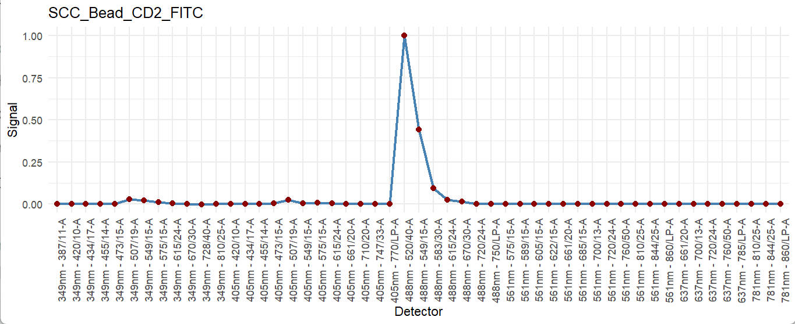
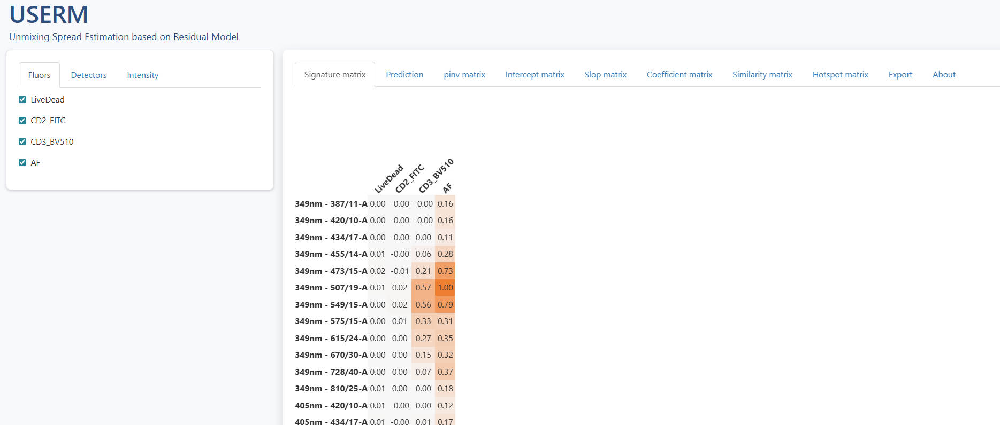
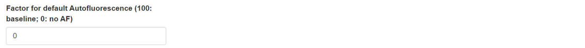
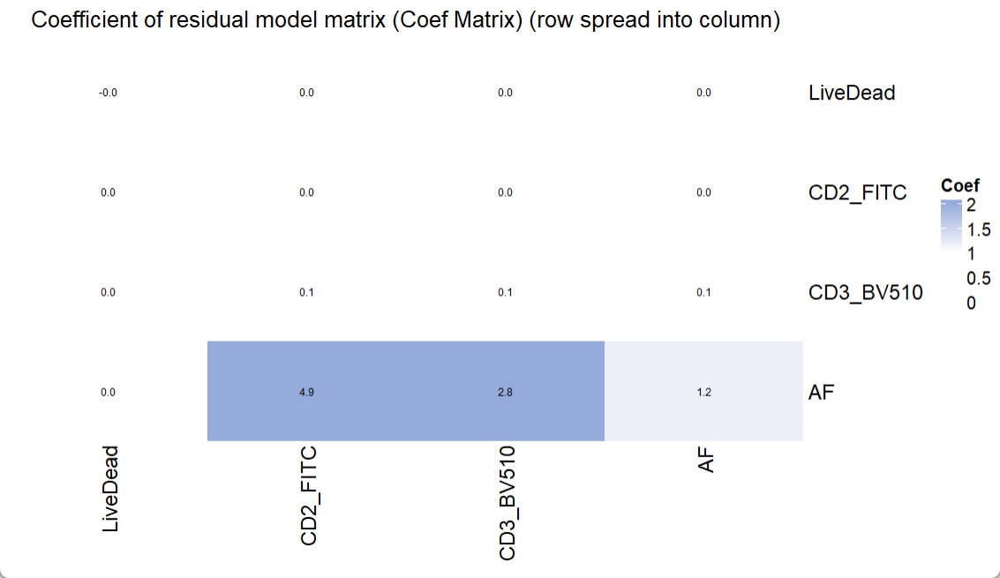
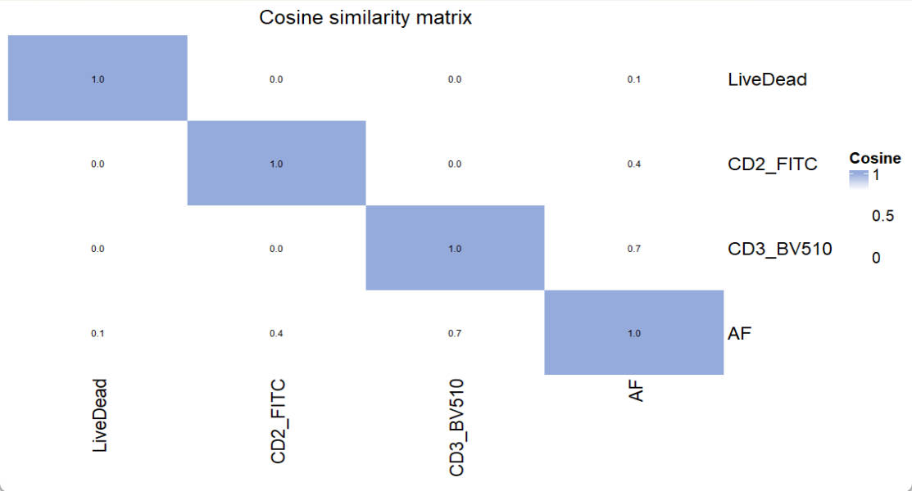

# Basic instruction for USERM use

Xiangming Cai

2025-11-22

## 🔍 Introduction

The USERM provides an out-of-box tool to apply the residual model approach [^1], which characterizes and predicts the spread of unmixed spectral flow cytometry data, which arises from instrumental noise or deviations between actual cellular emission and the average fluorescence signatures.

The USERM also supports computing various matrixes tools for panel design, including the Coef Matrix, the Hotspot Matrix, and the Similarity Matrix, and many others.


## 💻 Installation

You can install the development version of USERM from [GitHub](https://github.com/xiangmingcai) with:

``` r
devtools::install_github("xiangmingcai/USERM")
```

## Step 1 📈 query avalilable fluorescence list

You can use querySig function to query all available fluorescence.

``` r
library(USERM)
Sig_info = querySig()
head(Sig_info)
```

``` r
> head(Sig_info)
                    id PrimaryName SecondaryName detectors instrument       Source Note
1  SCC_Bead_CD4_NFR700         CD4        NFR700        51     Xenith XiangmingCai   NA
2   SCC_Bead_CD3_BV510         CD3         BV510        51     Xenith XiangmingCai   NA
3    SCC_Bead_CD2_FITC         CD2          FITC        51     Xenith XiangmingCai   NA
4       SCC_Bead_AF_AF          AF            AF        51     Xenith XiangmingCai   NA
5   SCC_Bead_CD8_BV570         CD8         BV570        51     Xenith XiangmingCai   NA
6 SCC_Bead_CD16_BUV805        CD16        BUV805        51     Xenith XiangmingCai   NA
```

To check signature of a specific fluroescence, you may

``` r
fluor_to_check = Sig_info$id[3]
print(fluor_to_check)
checkSig_linePlot(id = fluor_to_check)
```
``` r
> print(fluor_to_check)
[1] "SCC_Bead_CD2_FITC"
```
{width=500}


These available fluorescence were preprocessed with parameters extracted for residual model. To access the corresponding residaul model and its parameters, you can use the getRes function.

``` r
ResObj = getRes(id = fluor_to_check)
```
{width=500}


The ResObj Object contains all relavant informations. If you are interested, please read our paper (mentioned on the top) to know the concepts of each matrix shown here. See \code{\link{CreateRes}} and \code{\link{SlopEstimation}} for detailed introduction of the structure of ResObj.

You can easily visaulize all these matrixes, when you are interested in any one of them.

To check the slop matrix:
``` r
checkRes_slopMtx(Res = ResObj)
```

{width=500}

To check the intercept matrix:
``` r
checkRes_interceptMtx(Res = ResObj)
```

{width=500}

You can check the covariance matrix at a specified fluorescence intensity (bin):
``` r
print(ResObj$bin_mids)
checkRes_covMtx(Res = ResObj,bin=3)
```

{width=500}


You can even check the linear fitting of covariance versus fluorescence intensity (bin) between two speific detectors:
``` r
print(ResObj$detectors)
checkRes_covScatter(Res = ResObj,
                    detector1 = ResObj$detectors[1],
                    detector2 = ResObj$detectors[2])
```

{width=500}

## Step 2 🖊 Select and rename fluors and create SuprObj

You may now select fluorescence to make a panel. Of note, the targets (e.g. CD3, CD4) do not matter here, only the fluorescence matches. That means if you plan to use FITC-CD4 in you panel, you can use FITC-CD2 in the USERM to make estimation and prediction. 
If the fluorescence that you need were not available in the USERM, you can prepare single color control FCS file yourself and process it following this custom [instruction](../instruction_customFCS.md). 

Assume all fluorescence that you need is available, now you can select them out:
``` r
fluors_selected = c(Sig_info$id[c(32:34,63)])
fluors_selected

```
``` r
> fluors_selected
[1] "SCC_Cell_LD_LDNIR876" "SCC_Cell_CD2_FITC"    "SCC_Cell_CD3_BV510"   "SCC_Cell_AF_AF"   
```
Here we select 3 fluorescence plus autofluorescence (AF) to make a simple panel. If you expecting more (>40), just select all of them. Notely, both SCC Cells and Beads are using together. Based on our research, it is ok to use SCC beads for prediction.

Now, we can create the signature matrix of selected fluorescence
``` r
Sig_mtx  = getSigMtx(ids = fluors_selected) #(detectors x fluorescence)
dim(Sig_mtx)
```
``` r
> dim(Sig_mtx)
[1] 51 4
```

Then, we create a UsermObj to contain all ResObj. 

``` r
UsermObj = CreateUserm(A = Sig_mtx)
#add ResObj into UsermObj
for (save_suf in colnames(Sig_mtx)) {
  ResObj = getRes(id = save_suf)
  UsermObj = AddRes2Userm(Res = ResObj, Userm = UsermObj)
}
```

{width=500}

The UsermObj contains all information needed for prediction. The Res item is a list with ResObj of each fluorescence. The Scale_df item contains the scale setting for visualization afterward. It is ok to leave it as NA. Default linear scale will be applied (Options: "Linear", "Log10", "Arcsinh"). The Intensity_mtx contains the estimated fluorescence intensities of cell populations. In the example shown here, we have one default populaiton named "P1". You can modify the name or intensities or add new populations for interactive prediction in Step 3.


If you hope to rename the fluorescence, you can do this now:
``` r
UsermObj = RenameFluor(Userm = UsermObj,raw_name = "SCC_Cell_LD_LDNIR876",new_name = "LiveDead")
UsermObj = RenameFluor(Userm = UsermObj,raw_name = "SCC_Cell_CD2_FITC",new_name = "CD2_FITC")
UsermObj = RenameFluor(Userm = UsermObj,raw_name = "SCC_Cell_CD3_BV510",new_name = "CD3_BV510")
UsermObj = RenameFluor(Userm = UsermObj,raw_name = "SCC_Cell_AF_AF",new_name = "AF")
```
``` r
> UsermObj = RenameFluor(Userm = UsermObj,raw_name = "SCC_Cell_LD_LDNIR876",new_name = "LiveDead")
Successfully renamed SCC_Cell_LD_LDNIR876 as LiveDead
> UsermObj = RenameFluor(Userm = UsermObj,raw_name = "SCC_Cell_CD2_FITC",new_name = "CD2_FITC")
Successfully renamed SCC_Cell_CD2_FITC as CD2_FITC
> UsermObj = RenameFluor(Userm = UsermObj,raw_name = "SCC_Cell_CD3_BV510",new_name = "CD3_BV510")
Successfully renamed SCC_Cell_CD3_BV510 as CD3_BV510
> UsermObj = RenameFluor(Userm = UsermObj,raw_name = "SCC_Cell_AF_AF",new_name = "AF")
Successfully renamed SCC_Cell_AF_AF as AF  
```


## Step 3 🧮 Make prediction (optional)

We can now interactively predict spread with residual model, which accounts for instrumental noise and deviations between actual cellular emission and the average fluorescence signatures.

To predict for one population:
``` r
PredOneSpread(Userm = UsermObj,population_id = c("P1"))
```

{width=500}


You will see a pop-out shinyapp window. 

{width=500}


The left panel allows users to interactively select and un-select fluroescence and detectors, and modify intensities. So that users can flexibly explore the impact of fluorescence combination and intensities on the predicted spread. Of note, you can use set-all button to adjust all intensities together. This can be handy when you want to set all of them as 0 except one fluorescence, in which case you are simulating a SCC sample.

{width=500}

The right panel have some tabs. The signature matrix contains all normalized signatures. If you want to adjust the color threshold, you may scroll down to the bottom and set new color threshold. There are tow ways to use different color palette. First, you can get the matrix with mathods described in Step1 or Step4, and visualize with the Vis_Mtx function, which is also described in Step4. Another method is that you can directly copy and paste the whole matrix into Excel and apply distinct color palette in Excel or other software.

{width=500}

In the prediction tab, you will see a scatter plot visualizing the 95% range of predicted spread. Two display mode is supported: ***Pseudo-color*** and ***Counter-line***. It allows the selection of fluorescence for x and y axes. You can also adjsut the display limis of the axes. Scale is support with ***Linear***, ***Log10*** and ***Arcsinh*** options. For Arcsinh, users need to set a cofactor.

{width=500}

Of note, you can now set the ***Factor for default Autofluorescence*** to control the displayed spread from AF. the displayed spread will be multiplied with the (factor / 100). So, when the factor is set to 100, the estimated spread from AF will be displayed completely. If the factor is set to 0, the spread from AF will be removed. This helps to check only the spread from noise. 


{width=500}


The pinv matrix shows the pseudo-inverse of the signature matrix.


{width=500}


In the intercept matrix tab, you can check the intercept matrix of each SCC. 


{width=500}


The summary intercept matrix for each SCC is calculated as  The median value of all summary intercept matrixes is used in the prediction (last two rows).


{width=500}


In the slop matrix tab, you can check the slop matrix of each fluroescence. 


{width=500}


Similarly, The summary slop matrix for each fluorescence is calculated as  The summed value of all weighted slop matrixes is used in the prediction (last two rows).


<p align="center">


</p>

To check the detail of each number summary slop matrix, you can use the weighted tab. Select the fluorescence and the channels to be spread into, you can check the weighted slop matrix. The sum of the weighted slop matrix will be the corresponding value in the summary slop matrix. With the weighted slop matrix, you can explain why a severe spread occurs. 

<p align="center">


</p>

In the export tab, you may directly download a complete report of all the matrixes.
You may also export the N-by-N or N-by-1 plots, which could be quite big for a big panel. If you want to plot the N-by-N or N-by-1 plots with custom plot setting, you need to assign corresponding values to the UsermObj[["Scale_df"]]. Otherwise, default setting will be used.

Prediction for more than one population is possible. However, users need to set the intensities of populations in advance. Here we predict 3 populations together.
``` r
UsermObj$Intensity_mtx[,2] = 200*c(1:length(UsermObj$fluors))
UsermObj$Intensity_mtx[,3] = 300*c(1:length(UsermObj$fluors))
names(UsermObj$Intensity_mtx) = c("P1","P2","P3")
PredMultipleSpread(Userm = UsermObj,population_ids = c("P1","P2","P3"))
```
<p align="center">


</p>
All 3 populations will be shown together in the scatter plot. The design and the interactive web is similar to that for PredOneSpread function.

## Step 4 matrics estimation and visualization

The USERM supports multiple matrix tools for panel design, including the Coefficient Matrix, the Hotspot Matrix, and the Similarity Matrix, and the Spread Distance Matrix. All matrix can be visualized with the ***Vis_Mtx*** function.

To estimate a Coefficient Matrix:
``` r
Coef_mtx = EstimateCoefMtx(Userm = UsermObj)
Vis_Mtx(mat = Coef_mtx,mincolor = "white",midcolor = "white", maxcolor = "#95ABDB",
        max = 2,mid = 1,min = 0,legend_name = "Coef",
        title = "Coefficient of residual model matrix (Coef Matrix) (row spread into column)")

```
<p align="center">



</p>

In the Coefficient Matrix, a high coef number indicates high increasing trend of spread from one fluorescence (row) into another fluorescence (column), following the increase of fluorescence intensity. To interpret a high observed coef number and its related severe spread, researchers can use PredOneSpread function to look for the underlying mechanical explanation and potential solutions. A detailed example is provided in another [instruction](../instruction_interprateHighCoef.md). 

There is no specific threshold for "bad" coef number or "good" coef number. Because the fluorescence intensity also matters and it varies in different settings and conjugated targets. However, this Coef Matrix provides an approach to compare the estimated spread between panels. So that users can choose a panel with less expected spread. 

To estimate a Hotspot Matrix, only the signature matrix A is required:
``` r
Hotspot_mtx = EstimateHotspotMtx(A = UsermObj$A)
Vis_Mtx(mat = Hotspot_mtx,mincolor = "white",midcolor = "white", maxcolor = "#95ABDB",
        max = 2,mid = 1,min = 0,legend_name = "Hotspot",
        title = "Hotspot matrix")

```
<p align="center">


</p>

Based on the paper from Mage PL and et al.[^2], The diagonal entries of the Hotspot matrix are informative, as they reflect the degree to which each fluorescence contributes to unmixing-dependent spread.  

To estimate a Similarity Matrix, only the signature matrix A is required:
``` r
Similarity_mtx = EstimateSimilarityMtx(A = UsermObj$A)
Vis_Mtx(mat = Similarity_mtx,mincolor = "white",midcolor = "white", maxcolor = "#95ABDB",
        max = 1,mid = 0.8,min = 0,legend_name = "Cosine",
        title = "Cosine similarity matrix")
```
<p align="center">



</p>

For similarity matrix, a number higher than 0.98 indicates that signals from the pair of fluorescence cannot be well separated. So, one of them needs to be replaced by other fluorescence.

It is also possible to estimate the Spread Distance Matrix between two populations with estimated fluorescence intensities:
``` r
Spr1 = EstimateSpread(Userm = UsermObj,population_id = c("P1"))
Spr2 = EstimateSpread(Userm = UsermObj,population_id = c("P2"))
SpreadDistance_mtx = EstimateDistance(Spr1, Spr2)
Vis_Mtx(mat = SpreadDistance_mtx,mincolor = "darkred",midcolor = "white", maxcolor = "white",max = 1.5,mid = 1,min = 0,title = "Spread Distance matrix")
```
<p align="center">


</p>

For the Spread Distance matrix, a value < 1.0 indicates low resolution between these two cell populations. Of note, this results only accounts for spread, which originates from instrumental noise or deviations between actual cellular emission and the average fluorescence signatures. Also, it only holds for the given fluorescence intensities.

## 📚 Citation

If you use this package in your research, please cite our paper and the package as:
```
Xiangming Cai, Sara Garcia-Garcia, Nick Rohrbacker, Michaela Gianniou, Juan J. Garcia Vallejo. Manuscript in preparation. (to be update)

Cai X (2025). _USERM: Unmixing Spread Estimation with Residual Model_. R package version
  1.0.0,  <https://github.com/xiangmingcai/USERM>.
  
@Manual{,
    title = {USERM: Unmixing Spread Estimation with Residual Model},
    author = {Xiangming Cai},
    year = {2025},
    note = {R package version 1.0.0},
    url = {https://github.com/xiangmingcai/USERM},
  }
```


[^1]: Xiangming Cai, Sara Garcia-Garcia, Nick Rohrbacker, Michaela Gianniou, Juan J. Garcia Vallejo. Manuscript in preparation.

[^2]: Mage PL, Konecny AJ, Mair F. Measurement and prediction of unmixing-dependent spreading in spectral flow cytometry panels. bioRxiv [Preprint]. 2025. doi: 10.1101/2025.04.17.649396.
