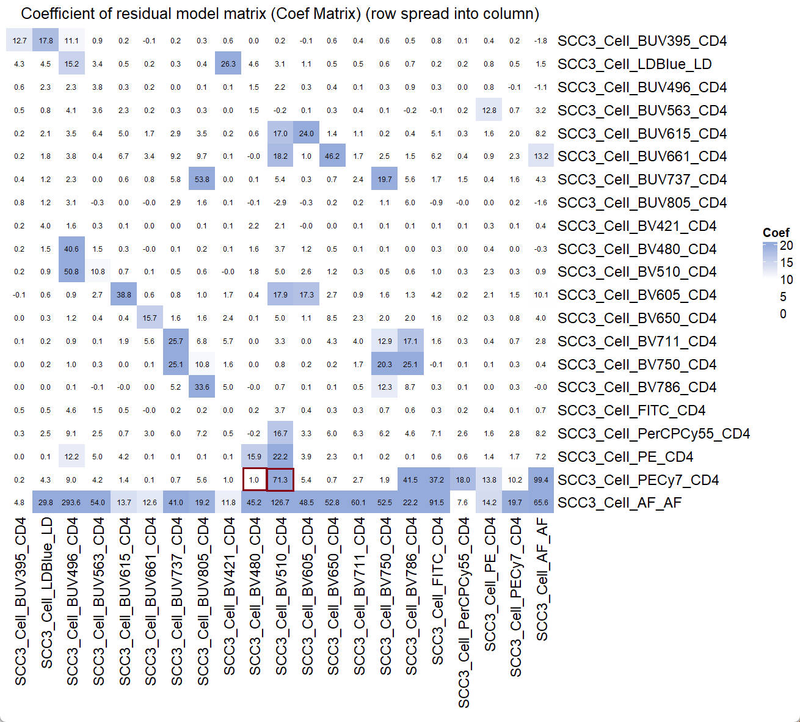
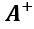
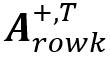
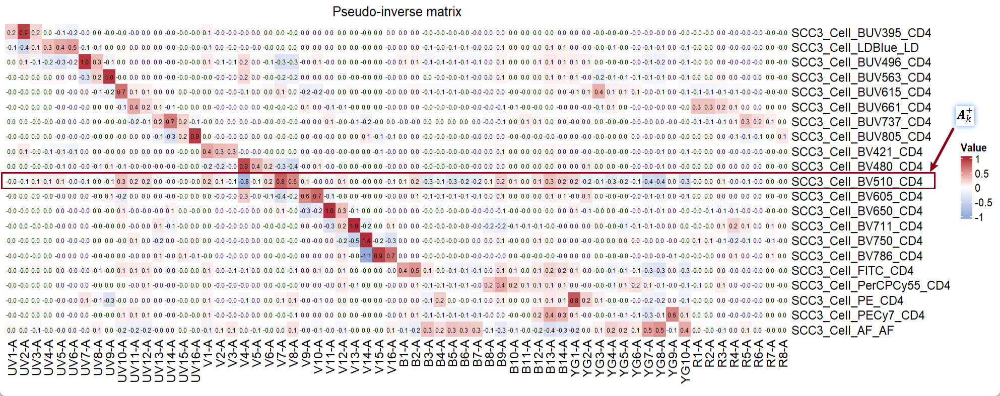
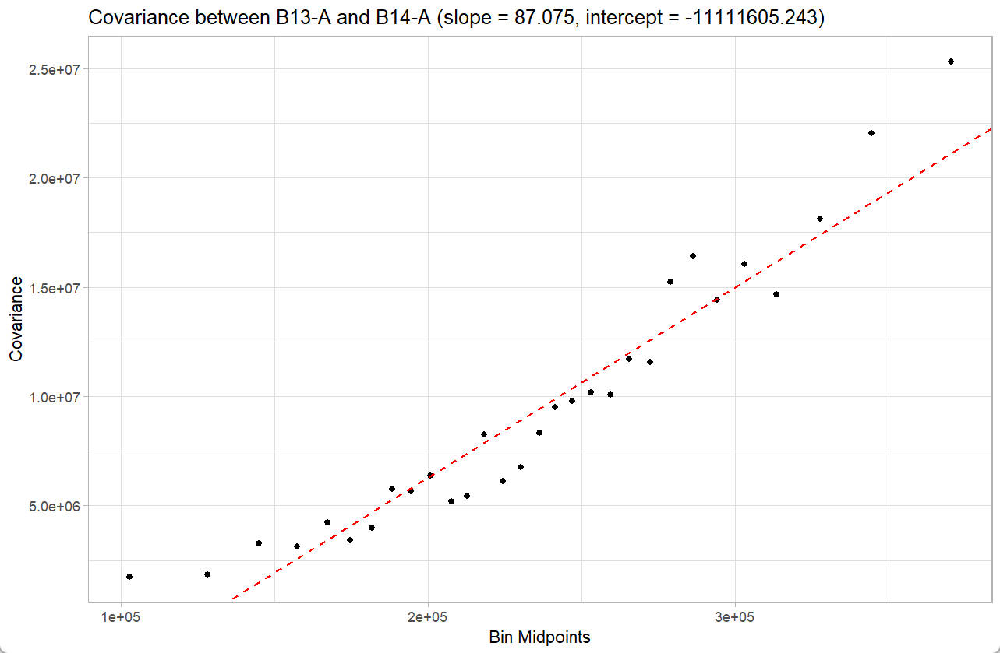
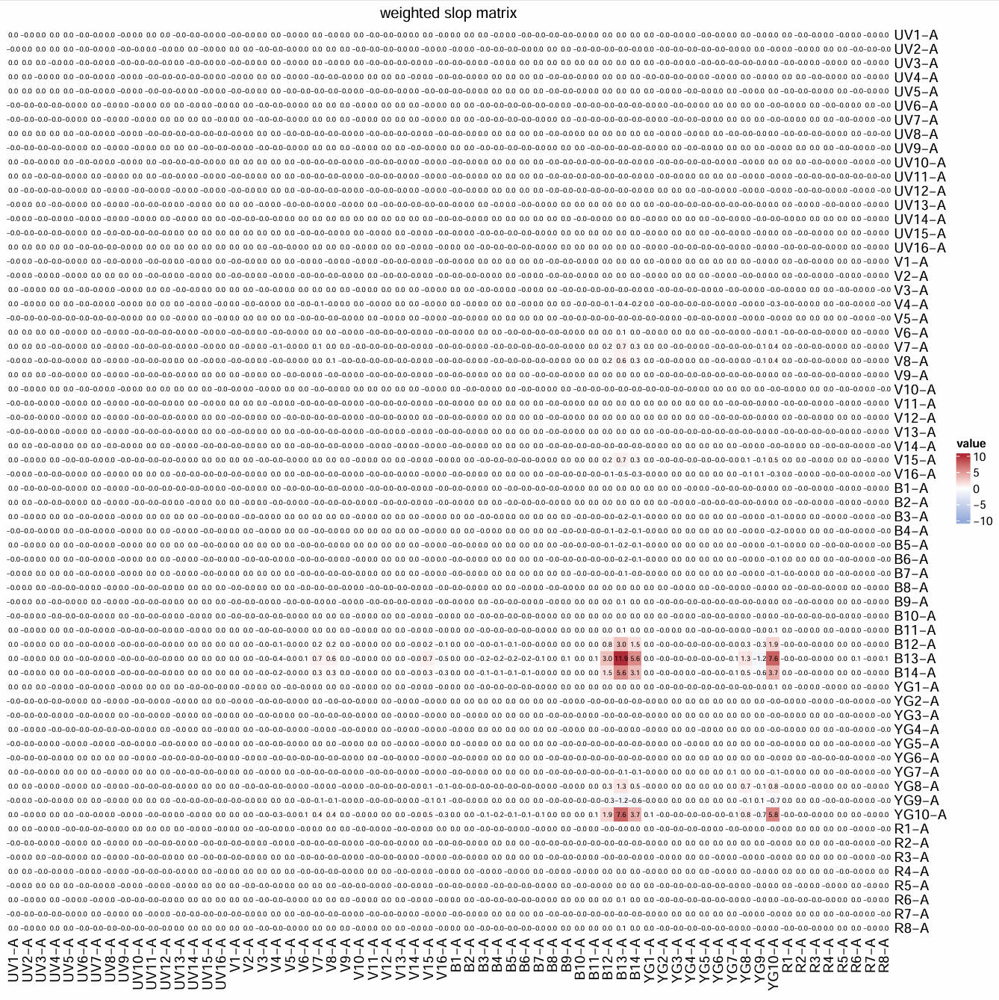
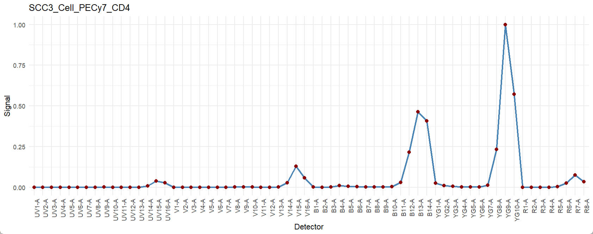

# Interprate the observed spread with USERM

Xiangming Cai

2025-11-22

## 🔍 Introduction
This instruction will show a case about how to interprate a high Coef value found in the Coef Matrix. Of note, here we only show how to check the reason of observed high spread. Strategy for panel adjustment is out of the scope of this instruction.

For basic instruction of the USERM, please refer to the basic [instruction](https://xiangmingcai.github.io/USERM/articles/instruction_basic.html).

## 💻 An example with high Coef value

### create a panel

Here we will use the USERM to make a 20 color + AF panel for Aurora 5L.
``` r
library(USERM)
# Step 1 querySig
Sig_info = querySig()
head(Sig_info)

# Step 2 Select fluors and create UsermObj
fluors_selected = c(Sig_info$id[c(149,201,150,151,
                                  152,153,154,155,
                                  156,157,158,159,
                                  160,161,162,163,
                                  189,200,196,199,138)])
print(fluors_selected)
Sig_mtx  = getSigMtx(ids = fluors_selected)
dim(Sig_mtx)

UsermObj = CreateUserm(A = Sig_mtx)
#add ResObj into UsermObj
for (save_suf in colnames(Sig_mtx)) {
  ResObj = getRes(id = save_suf)
  UsermObj = AddRes2Userm(Res = ResObj, Userm = UsermObj)
}

# Step 4 matrics estimation and visualization
Coef_mtx = EstimateCoefMtx(Userm = UsermObj)
Vis_Mtx(mat = Coef_mtx,mincolor = "white",midcolor = "white", maxcolor = "#95ABDB",
        max = 20,mid = 10,min = 0,legend_name = "Coef",
        title = "Coefficient of residual model matrix (Coef Matrix) (row spread into column)")

```
``` r
> head(Sig_info)
                    id PrimaryName SecondaryName detectors instrument       Source Note
1  SCC_Bead_CD4_NFR700         CD4        NFR700        51     Xenith XiangmingCai   NA
2   SCC_Bead_CD3_BV510         CD3         BV510        51     Xenith XiangmingCai   NA
3    SCC_Bead_CD2_FITC         CD2          FITC        51     Xenith XiangmingCai   NA
4       SCC_Bead_AF_AF          AF            AF        51     Xenith XiangmingCai   NA
5   SCC_Bead_CD8_BV570         CD8         BV570        51     Xenith XiangmingCai   NA
6 SCC_Bead_CD16_BUV805        CD16        BUV805        51     Xenith XiangmingCai   NA

> print(fluors_selected)
 [1] "SCC3_Cell_BUV395_CD4"    "SCC3_Cell_LDBlue_LD"     "SCC3_Cell_BUV496_CD4"   
 [4] "SCC3_Cell_BUV563_CD4"    "SCC3_Cell_BUV615_CD4"    "SCC3_Cell_BUV661_CD4"   
 [7] "SCC3_Cell_BUV737_CD4"    "SCC3_Cell_BUV805_CD4"    "SCC3_Cell_BV421_CD4"    
[10] "SCC3_Cell_BV480_CD4"     "SCC3_Cell_BV510_CD4"     "SCC3_Cell_BV605_CD4"    
[13] "SCC3_Cell_BV650_CD4"     "SCC3_Cell_BV711_CD4"     "SCC3_Cell_BV750_CD4"    
[16] "SCC3_Cell_BV786_CD4"     "SCC3_Cell_FITC_CD4"      "SCC3_Cell_PerCPCy55_CD4"
[19] "SCC3_Cell_PE_CD4"        "SCC3_Cell_PECy7_CD4"     "SCC3_Cell_AF_AF"  

> dim(Sig_mtx)
[1] 64 21
```
<p align="center">



</p>

From the Coef Matrix, we find the high Coef value of PECy7 spread into BV510, which equals to 71.3. On the contrary, the coef value of PECy7 spread into BV480 is very low, which equals to 1.0.

### verify the high coef value

We will first verify the spread at a single-color control (SCC) setting (PECy7). Then we will use the USERM to look for the reason of this high coef value, so that we can understand why there is a high spread from PECy7 into BV510.

To make a single-color control setting, we can create 3 SCC populations first.

``` r
#create 3 populations with all zero fluroescence intensities
UsermObj$Intensity_mtx[,1] = 0
UsermObj$Intensity_mtx[,2] = UsermObj$Intensity_mtx[,1]
UsermObj$Intensity_mtx[,3] = UsermObj$Intensity_mtx[,1]
# assign 100, 500, 1000 to the PECy7 intensities of these 3 populations
UsermObj$Intensity_mtx[20,1] = 100
UsermObj$Intensity_mtx[20,2] = 500
UsermObj$Intensity_mtx[20,3] = 1000
print(UsermObj[["Intensity_mtx"]])
```
``` r
> print(UsermObj[["Intensity_mtx"]])
                         V1  V2   V3
SCC3_Cell_BUV395_CD4      0   0    0
SCC3_Cell_LDBlue_LD       0   0    0
SCC3_Cell_BUV496_CD4      0   0    0
SCC3_Cell_BUV563_CD4      0   0    0
SCC3_Cell_BUV615_CD4      0   0    0
SCC3_Cell_BUV661_CD4      0   0    0
SCC3_Cell_BUV737_CD4      0   0    0
SCC3_Cell_BUV805_CD4      0   0    0
SCC3_Cell_BV421_CD4       0   0    0
SCC3_Cell_BV480_CD4       0   0    0
SCC3_Cell_BV510_CD4       0   0    0
SCC3_Cell_BV605_CD4       0   0    0
SCC3_Cell_BV650_CD4       0   0    0
SCC3_Cell_BV711_CD4       0   0    0
SCC3_Cell_BV750_CD4       0   0    0
SCC3_Cell_BV786_CD4       0   0    0
SCC3_Cell_FITC_CD4        0   0    0
SCC3_Cell_PerCPCy55_CD4   0   0    0
SCC3_Cell_PE_CD4          0   0    0
SCC3_Cell_PECy7_CD4     100 500 1000
SCC3_Cell_AF_AF           0   0    0
```

Now, we can predict the spread of these 3 populations.
``` r
PredMultipleSpread(Userm = UsermObj,population_ids = c("V1","V2","V3"))
```

Set the ***Factor for default Autofluorescence*** to be 0, so that we remove the spread from intercept matrix, which represents the spread from AF. Adjust the range of axes and we can saw this predicted plot: 

<p align="center">


</p>

The plot shows an increasing trend in the spread from PECy7 into BV510 as the fluorescence intensity of PECy7 increases. Now we can switch the x axis to BV480.

<p align="center">


</p>

From the plot, it is clear that the PECy7 barely spread into BV480, compared to that for BV510. These observation verify what we find in the coef matrix.

New we want to know why there is a high spread from PECy7 into BV510. 

## Why there is a high spread?

Let's first take a look at the key part of the residual model[^1], which is used to predict the spread from a SCC fluorescence ***h*** (PECy7) into the fluorescence ***k*** (BV510):

<p align="center">


</p>

In this formulation,  is the intensity of fluroescence ***h***.  is the pseudo-inverse of the signature matrix .  is the ***k***-th row of the pseudo-inverse . The  is the slope matrix (will explain later). And the  is the transpose of the . The multiplied results of them is the predicted spread from the fluorescence ***h*** into fluorescence ***k***. 

For detailed explanation of the Matrix multiplication, please check the [Matrix multiplication](https://en.wikipedia.org/wiki/Matrix_multiplication)


Now, let's visualize these matrixes to have a clear understanding of them. I will circle the key components from the matrixes.

### 1. signature matrix

We can first visualize the signature matrix, this is simply the signatures of all fluorescence in the panel.
``` r
A = UsermObj$A
Vis_Mtx(mat = A,mincolor = "white",midcolor = "#D03E4C", maxcolor = "#B02B38",
        max = 1,mid = 0.5,min = 0,legend_name = "Signal",
        title = "Signature matrix")
```

<p align="center">


</p>

### 2. pseudo-inverse matrix

Now, we calculate the pseudo-inverse of the signature matrix. For detailed explanation of the pseudo-inverse, please check the [Generalized-inverse](https://en.wikipedia.org/wiki/Generalized_inverse)
``` r
library(MASS)
A_pinv = ginv(A)
colnames(A_pinv) = rownames(A)
rownames(A_pinv) = colnames(A)
Vis_Mtx(mat = A_pinv,mincolor = "#95ABDB",midcolor = "white", maxcolor = "#B02B38",
        max = 1,mid = 0,min = -1,legend_name = "Value",
        title = "Pseudo-inverse matrix")
```
<p align="center">



</p>
The circled line is the . 

### 3. slope matrix

Following the order of the components in the formula, we can now visualize the slope matrix of the fluorescence ***h***:
``` r
slop_mtx = UsermObj$Res$SCC3_Cell_PECy7_CD4$slopMtx
Vis_Mtx(mat = slop_mtx,mincolor = "#95ABDB",midcolor = "white", maxcolor = "#B02B38",
        max = 1,mid = 0,min = -1,legend_name = "beta",
        title = "slope matrix")
```
<p align="center">


</p>

The whole matrix is the slope matrix. The ***slope*** matrix is a ***m*** detectors x ***m*** detectors matrix. Each detector has its own residual signals (see [^1]), which accounts to the spread in fluroescence ***k***. The covariance between detector ***i*** and detector ***j*** will be calculated. The covariance is linearly related to the intensity of fluorescence ***h***. A linear model is fit to describe the relationship and generate a slope value (beta). So, in the ***slope*** matrix, a slope value represents the linear relationship between the covariance of corresponding pair of detectors versus the intensity of fluorescence ***h***.

We can visualized the linear relationship between the covariance of B13-A and B14-A versus the fluorescence intensity of the fluorescence ***h*** (PECy7):

``` r
ResObj = UsermObj$Res$SCC3_Cell_PECy7_CD4
ResObj$detectors
checkRes_covScatter(Res = ResObj,
                    detector1 = "B13-A",
                    detector2 = "B14-A")
```
``` r
> ResObj$detectors
 [1] "UV1-A"  "UV2-A"  "UV3-A"  "UV4-A"  "UV5-A"  "UV6-A"  "UV7-A"  "UV8-A"  "UV9-A"  "UV10-A" "UV11-A"
[12] "UV12-A" "UV13-A" "UV14-A" "UV15-A" "UV16-A" "V1-A"   "V2-A"   "V3-A"   "V4-A"   "V5-A"   "V6-A"  
[23] "V7-A"   "V8-A"   "V9-A"   "V10-A"  "V11-A"  "V12-A"  "V13-A"  "V14-A"  "V15-A"  "V16-A"  "B1-A"  
[34] "B2-A"   "B3-A"   "B4-A"   "B5-A"   "B6-A"   "B7-A"   "B8-A"   "B9-A"   "B10-A"  "B11-A"  "B12-A" 
[45] "B13-A"  "B14-A"  "YG1-A"  "YG2-A"  "YG3-A"  "YG4-A"  "YG5-A"  "YG6-A"  "YG7-A"  "YG8-A"  "YG9-A" 
[56] "YG10-A" "R1-A"   "R2-A"   "R3-A"   "R4-A"   "R5-A"   "R6-A"   "R7-A"   "R8-A" 
```
<p align="center">



</p>

### 4. transpose of the pseudo-inverse matrix

Now, we continue with the last component in the formula, transpose of the pseudo-inverse matrix:
``` r
A_pinv_t = t(A_pinv)
Vis_Mtx(mat = A_pinv_t,mincolor = "#95ABDB",midcolor = "white", maxcolor = "#B02B38",
        max = 1,mid = 0,min = -1,legend_name = "Value",
        title = "transpose of Pseudo-inverse matrix")
```
<p align="center">


</p>
The circled column is the . 

### 5. sum of the weighted slope matrix represents the observed spread

#### 5.1 reshape formula

To better understand the formula, we can reshape it as:
<p align="center">


</p>

The indices ***i*** and ***j*** represents the ***i***-th row and ***j***-th column in the slope matrix.
The formula can be interpreted as the sum over the weighted slope matrix, where the weight is the product of the ***i***-th and ***j***-th values in the .

#### 5.2 weight matrix

We can compute the weight matrix, in which the value in the ***i***-th row and ***j***-th column is the product of the ***i***-th and ***j***-th value in the  :
``` r
weight_mtx = A_pinv["SCC3_Cell_BV510_CD4",] %o% A_pinv["SCC3_Cell_BV510_CD4",]
Vis_Mtx(mat = weight_mtx,mincolor = "#95ABDB",midcolor = "white", maxcolor = "#B02B38",
        max = 1,mid = 0,min = -1,legend_name = "weight",
        title = "weight matrix")
```
<p align="center">


</p>

We can immediately find that most of the values in the weight matrix is zero. For detailed explanation of the outer product conducted here, please check the [Outer Product](https://en.wikipedia.org/wiki/Outer_product)

#### 5.3 weighted slope matrix

We can further visualize the weighted slope matrix:
``` r
weighted_slope_mtx = weight_mtx * slop_mtx
Vis_Mtx(mat = weighted_slope_mtx,mincolor = "#95ABDB",midcolor = "white", maxcolor = "#B02B38",
        max = 10,mid = 0,min = -10,legend_name = "value",
        title = "weighted slop matrix")
sum(weighted_slope_mtx)
```
``` r
> sum(weighted_slope_mtx)
[1] 71.32371
```
<p align="center">



</p>
The sum of all values in the weighted slope matrix is the predicted spread from fluorescence ***h*** into fluorescence ***k***. These values can be negative, 0, or positive. It is obvious that only few values contribute to the overall sum. These contributing values correspond to detector pairs of B12-A, B13-A, B14-A, and YG10-A.

>In conclusion, the high spread from fluorescence ***h*** (PECy7) into fluorescence ***k***  (BV510) is related to the circled value in the peseudo-inverse matrix and the slop matrix. 

>In another word, it is not only influenced by the overall signature matrix, but also by the linear relationship between the covariance among residual signals of detector B12-A, B13-A, B14-A, and YG10-A and the intensity of fluorescence ***h*** (PECy7).

### 6. compare the coef with other tools

#### 6.1 fluorescence signature
We can check the signature of PECy7:
``` r
checkSig_linePlot(id = "SCC3_Cell_PECy7_CD4")
``` 
<p align="center">



</p>

Some peak channels appear to be related to our conclusion, although the connection remains unclear.

#### 6.2 similarity matrix

To check the similarity matrix:
``` r
Similarity_mtx = EstimateSimilarityMtx(A = UsermObj$A)
Vis_Mtx(mat = Similarity_mtx,mincolor = "white",midcolor = "white", maxcolor = "#95ABDB",
        max = 1,mid = 0.8,min = 0,legend_name = "Cosine",
        title = "Cosine similarity matrix")
``` 
<p align="center">


</p>
No clear conflicting fluorescence were found.

#### 6.3 Hotspot matrix

To check the Hotspot matrix:
``` r
Hotspot_mtx = EstimateHotspotMtx(A = UsermObj$A)
# pdf(file = "E:/ResidualModel/HotspotMtx.pdf",width = 10,height = 10)
Vis_Mtx(mat = Hotspot_mtx,mincolor = "white",midcolor = "white", maxcolor = "#95ABDB",
        max = 2,mid = 1,min = 0,legend_name = "Hotspot",
        title = "Hotspot matrix")
``` 
<p align="center">


</p>
The spread from PECy7 into BV510 was not identified. 

## Perspective

We think the Coef Matrix can be a good complementary to available tools. We want to encourage researchers to use all of these tools for panel design and optimize unmixed results if possible. The USERM package can be an out-of-box tool to apply these commonly used tools and makes the panel design better.


## 📚 Citation

If you use this package in your research, please cite our paper and the package as:
```
Xiangming Cai, Sara Garcia-Garcia, Nick Rohrbacker, Michaela Gianniou, Juan J. Garcia Vallejo. Manuscript in preparation. (to be update)

Cai X (2025). _USERM: Unmixing Spread Estimation with Residual Model_. R package version
  1.0.0,  <https://github.com/xiangmingcai/USERM>.
  
@Manual{,
    title = {USERM: Unmixing Spread Estimation with Residual Model},
    author = {Xiangming Cai},
    year = {2025},
    note = {R package version 1.0.0},
    url = {https://github.com/xiangmingcai/USERM},
  }
```

[^1]: Xiangming Cai, Sara Garcia-Garcia, Nick Rohrbacker, Michaela Gianniou, Juan J. Garcia Vallejo. Manuscript in preparation.

